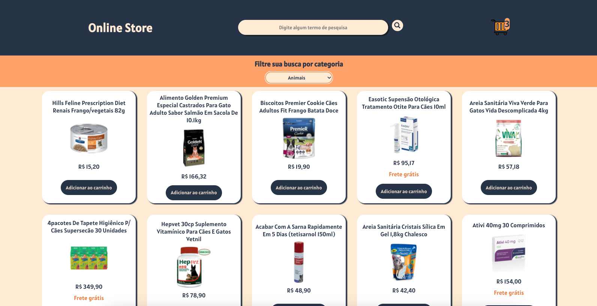

# OnlineStore

A aplicação é uma simulação de um e-commerce, sendo possível realizar um produto específico e também filtrando por categorias.
Você pode adicionar e remover produtos do carrinho de compras.
Clique no link abaixo para acessar a aplicação.

[Deploy OnlineStore](https://online-store-group13.vercel.app/)

O conteúdo é de uma [API](http://developers.mercadolibre.com) do Mercado Libre.

Colaboradores:
[Bruno Alvim Duarte](https://github.com/Bruno-Alvim-Duarte)
[Filipe Bueno](https://github.com/filipebueno85)
[Guilherme Lucena](https://github.com/Gui-lfm)
[Julia Magalhães](https://github.com/juliamglhs)
[Marcelo H P da Silva](https://github.com/dev-celo)
